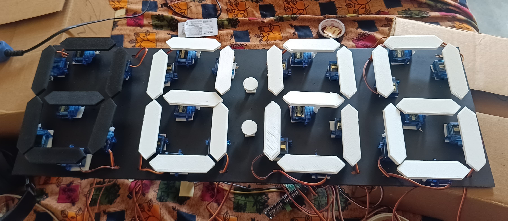

# Counter Clock Project

A unique mechanical digital clock that uses servo motors to physically flip segments, creating a mesmerizing analog-like digital display. Built with ESP-IDF framework, this project combines precise servo control with accurate timekeeping to deliver a distinctive time display experience.

Key innovations:

- Mechanical 7-segment display using 28 micro servos (7 per digit)
- Hybrid digital-analog visual effect
- Silent operation through optimized PWM control
- Energy-efficient design with sleep modes

## Hardware Demonstration



[View Video Demonstration](assets/clock.mp4)

## I2C Configuration

The system uses two I2C devices:

1. **DS1307 Real-Time Clock** (Default address 0x68)

   - Provides accurate timekeeping
   - Battery-backed for continuous operation

2. **PCA9685 PWM Controllers** (Addresses 0x40 and 0x41)
   - Controls 32 servo motors (16 channels per controller)
   - 12-bit resolution for precise angle control
   - 50Hz PWM frequency standard for servos

**I2C Troubleshooting Tips:**

- Verify connections with `i2cdetect` tool
- Ensure pull-up resistors (4.7kΩ) are present on SDA/SCL
- Check for address conflicts if adding more devices
- Monitor I2C errors in ESP-IDF logs

## Features

- 4-digit display using servo-controlled segments
- Precise timekeeping with DS1307 RTC
- PCA9685 PWM controller for servo management
- Customizable segment angles

## Installation

```bash
# Clone this repository
git clone --recursive https://github.com/PiyushPatle26/Counter-Clock.git
cd Counter-Clock

# Build and flash
idf.py build
idf.py -p /dev/ttyUSB0 flash monitor
```

## Configuration

- Adjust `pulse_0deg` and `pulse_90deg` in `final_clock.c` for your servo calibration
- Set proper I2C addresses in config.h

## Components Used

- ESP32 microcontroller
- 28 servo motors (7 per digit)
- 2x PCA9685 PWM controllers
- DS1307 real-time clock

## Project Report

[report Link](https://docs.google.com/document/d/1q5xvmOw9YiV045bbDlcQbDAQpm_l3vye6wUiXI0P7eM/edit?tab=t.0#heading=h.edmfe2u44n0s)
